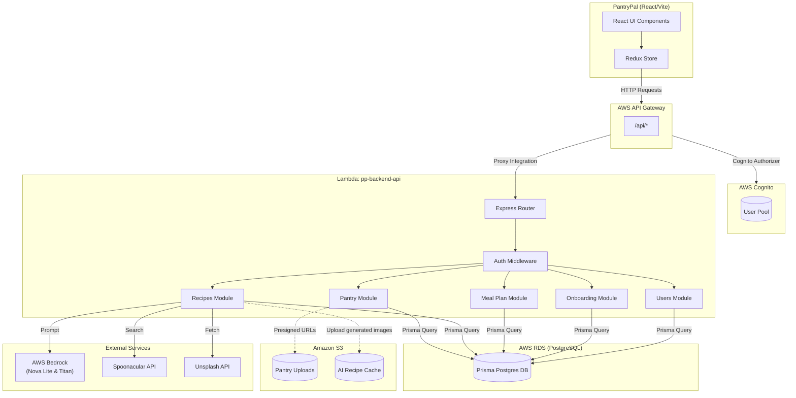
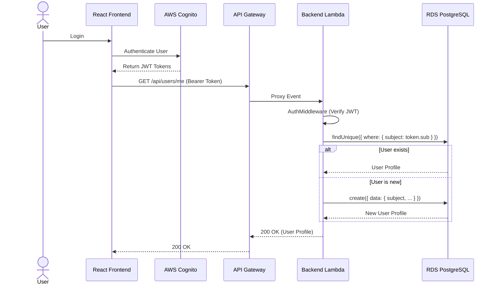
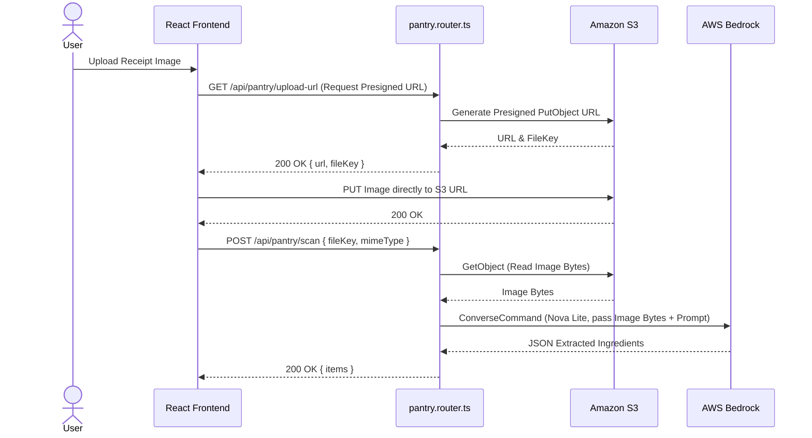
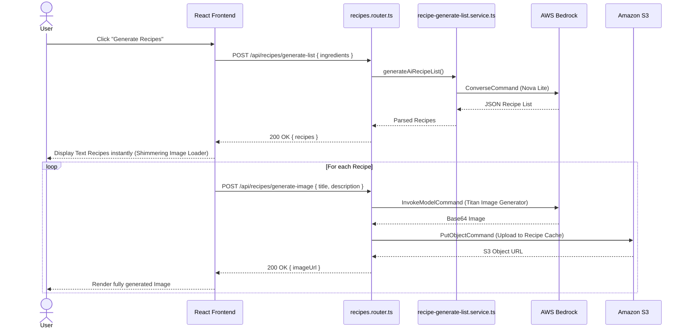
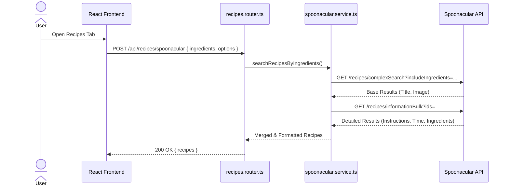
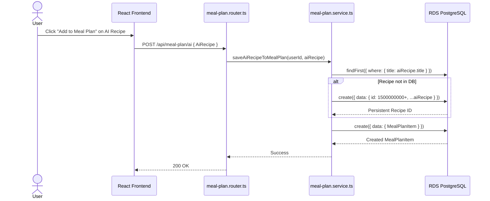

# PantryPal Backend (`pp-backend`) — Codebase Report

**Group #3 | PROG8950 Capstone | Conestoga College (Winter 2026)**

---

## Tech Stack

| Layer | Technology |
|---|---|
| Runtime | Node.js (TypeScript) |
| Framework | Express.js wrapped with `@vendia/serverless-express` |
| Database | PostgreSQL (Amazon RDS) |
| ORM | Prisma Client v6 |
| Authentication | AWS Cognito (JWT Validation Middleware) |
| Infrastructure as Code | Terraform (v1.5+) |
| Storage | Amazon S3 (Pantry Uploads & AI Image Cache) |
| External APIs | Spoonacular API (Recipes), Unsplash/Pexels API (Images) |
| AI / LLM | AWS Bedrock (`amazon.nova-lite-v1:0`, `amazon.titan-image-generator-v1`) via AWS SDK v3 |

---

## Architecture Diagram



---

## Project Structure

```text
pp-backend/
├── infra/
│   └── terraform/           # Terraform IaC files (main.tf, rds.tf, lambda.tf, etc.)
├── prisma/
│   ├── schema.prisma        # Database schema definitions
│   └── seed.ts              # Database seeding scripts
├── scripts/                 # Utility scripts (setup, bundle-lambda, destroy, etc.)
└── src/                     # Application Source Code
    ├── common/              # Shared utilities (AWS, S3, Prisma client, routing)
    ├── modules/             # Feature modules (Domain-Driven Design)
    │   ├── api/             # Main API Router
    │   ├── auth/            # JWT validation middleware
    │   ├── ingredients/     # Standardized ingredient logic
    │   ├── meal-plan/       # Meal planner logic and endpoints
    │   ├── onboarding/      # User onboarding workflow
    │   ├── pantry/          # Pantry inventory and receipt scanning
    │   ├── recipes/         # AI Generation, Spoonacular search, Image generation
    │   └── users/           # User profile management
    ├── lambda.ts            # Entrypoint for AWS Lambda (@vendia/serverless-express)
    └── main.ts              # Entrypoint for Local Development (Express server)
```

---

## Key Features & Flows

1. **Authentication & Identity:** Uses AWS Cognito to issue JWTs. The backend middleware decodes and verifies the JWT, extracting the user `sub` (subject ID) to map to a PostgreSQL `User` record.
2. **Pantry Management:** Users can add, edit, and remove ingredients from their pantry.
3. **Receipt Scanning:** Users upload receipt images. The backend uses AWS Bedrock to parse the image into a structured JSON list of ingredients.
4. **Spoonacular Recipes:** Users can search for recipes using their pantry ingredients via the Spoonacular API.
5. **AI Chef:** AWS Bedrock generates entirely custom recipes based on active pantry items, and Amazon Titan generates photorealistic images of the dish asynchronously.
6. **Meal Planning:** Users can assign recipes (both Spoonacular and AI-generated) to a persistent meal planner stored in RDS.

---

## Sequence Charts

### 1. User Authentication & Profile Lookup



### 2. Receipt Scanning (Pantry)



### 3. AI Recipe & Image Generation (Async Flow)



### 4. Spoonacular Recipe Search



### 5. Add AI Recipe to Meal Plan



---

## Data Persistence Summary

The database uses PostgreSQL (via Amazon RDS) and is managed via Prisma ORM.

### Core Tables:
*   `User`: Primary profile linked to AWS Cognito (`subject`).
*   `PantryItem`: Belongs to `User`. Stores name, quantity, category, and expiration date.
*   `Recipe`: Stores recipe metadata (Spoonacular or AI-generated). AI recipes are dynamically saved here when added to a meal plan to ensure relational integrity.
*   `MealPlanItem`: Junction table linking `User` and `Recipe`. Represents a planned meal.
*   `UserPreference`: Stores dietary restrictions, allergies, and cooking skill level gathered during onboarding.

---

## Running Locally

To run the backend locally on your machine (it will connect to your cloud RDS database and AWS services):

1. **Install Dependencies:**
   ```bash
   npm install
   ```

2. **Sync Cloud Environment Variables:**
   ```bash
   npm run env:from-tf
   ```
   *This copies your AWS outputs (Database URL, API URL, etc.) from Terraform into your `.env` file.*

3. **Start Local Express Server:**
   ```bash
   npm run dev
   ```
   *The API will start at `http://localhost:3000/api`.*

---

## Deployment Steps

Because this architecture uses AWS Lambda, the backend code does **not** deploy automatically when you push to GitHub. You must bundle and deploy it manually.

**To deploy code changes to AWS:**
```bash
npm run deploy
```
*(Windows Users: Run `cmd /c npm run deploy` if you encounter execution policy errors.)*

**What this does:**
1. Uses `esbuild` to compile all TypeScript files into a single optimized `dist/main.js`.
2. Packages the output into a `.zip` archive.
3. Runs `terraform apply` to upload the new zip to AWS Lambda and update any modified infrastructure.
