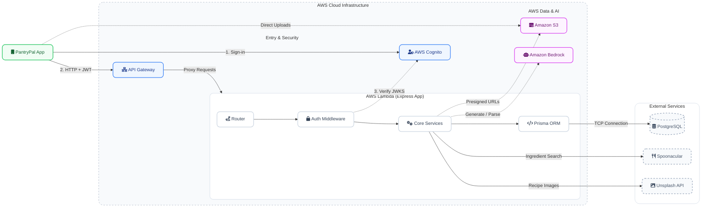
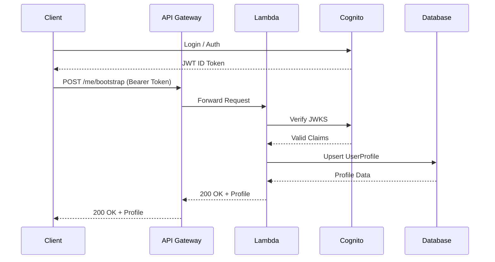
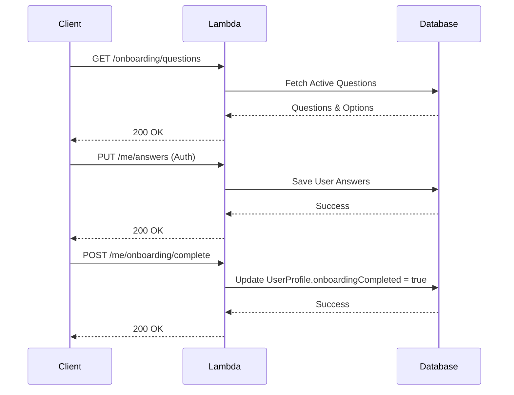
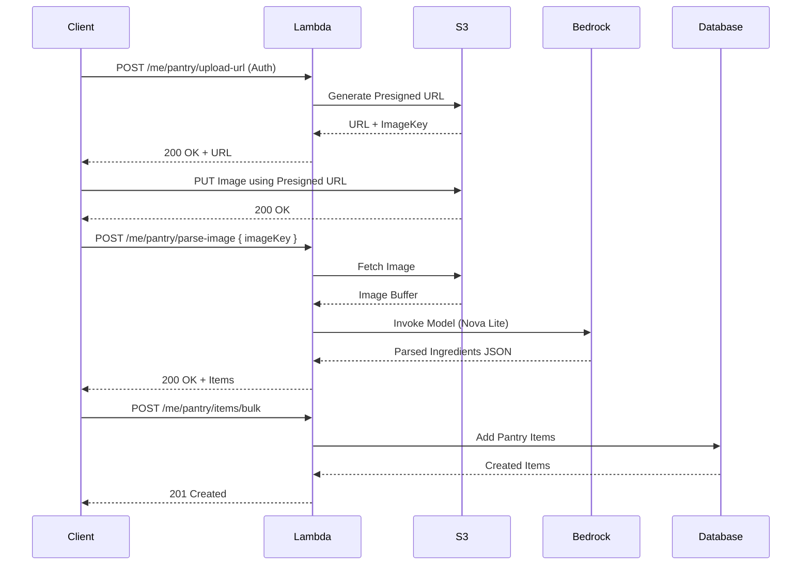
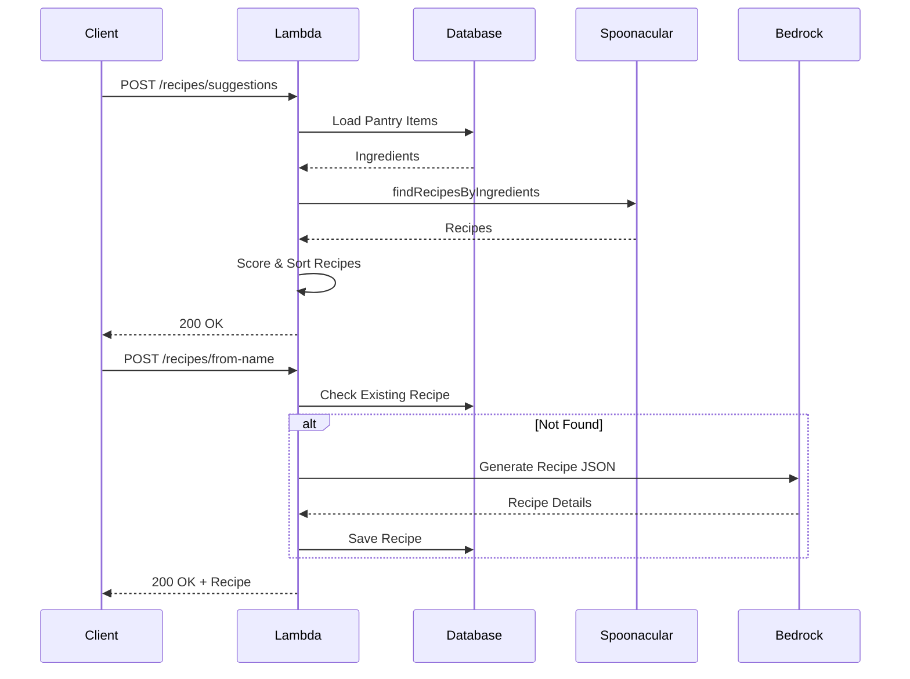
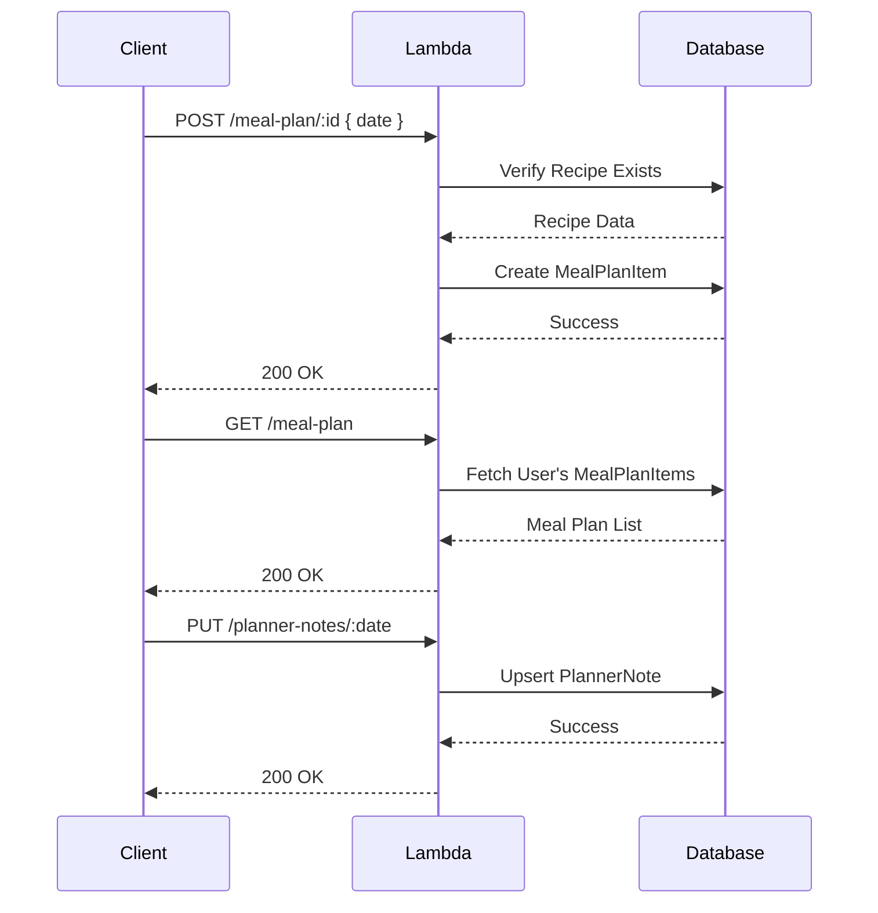

# PantryPal V3 — Backend API Requirements (`apps/api`)

## Scope
Backend only. Only features that exist in V2. All data stored in PostgreSQL via Prisma. No DynamoDB.

---

## 1. Stack

| Concern | Choice |
|---------|--------|
| Runtime | Node.js 20, TypeScript, ESM |
| HTTP | Express (local) + `lambda.ts` adapter (prod) |
| Database | PostgreSQL via Prisma 6 |
| AI — image scan | AWS Bedrock Nova Lite (`amazon.nova-lite-v1:0`) |
| AI — recipe gen | AWS Bedrock Nova Lite (`amazon.nova-lite-v1:0`) |
| Image storage | AWS S3 (pantry uploads + recipe image cache) |
| Auth | AWS Cognito — JWKS verification via `jose` |
| Validation | Zod |
| Dev runner | `tsx watch` |

---

## Architecture



---

## Backend Services

### Amazon API Gateway
Amazon API Gateway exposes PantryPal’s backend as a public HTTPS API. The frontend calls this API using the base URL stored in `VITE_API_URL` and accesses endpoints such as `/api/*` and `/health`. API Gateway routes requests to AWS Lambda and must be configured with correct CORS so requests from the Amplify domain succeed. It also supports throttling and logging to protect and monitor the API.

### AWS Lambda
AWS Lambda runs the core Node.js Express application in a serverless environment. Using the serverless adapter, it wraps the Express routers and handles all business logic, ORM queries, and API routing. It scales automatically based on incoming API Gateway requests.

### AWS Cognito
AWS Cognito provides secure user authentication and authorization. The frontend authenticates directly with the Cognito User Pool and receives a JWT ID token. The backend Express app verifies this token against Cognito's JWKS endpoint using the `jose` library in its Auth Middleware to protect secure routes.

### Amazon S3
Amazon S3 is used as a secure, scalable object storage for the application. It handles user-uploaded pantry images (via presigned URLs generated by Lambda) and caches AI-generated recipe images to minimize external API costs.

### Amazon Bedrock (Nova Lite)
Amazon Bedrock provides the generative AI capabilities using the Nova Lite model (`amazon.nova-lite-v1:0`). It is invoked by Lambda to perform complex NLP tasks, such as parsing messy pantry image scans into structured ingredient data, and generating creative recipe lists and instructions.

### PostgreSQL
A PostgreSQL relational database, accessed via Prisma ORM, stores all structured application data including user profiles, pantry inventory, saved recipes, and meal plans.

### Third-Party APIs
- **Spoonacular API**: Used to search for and suggest recipes based on the user's available pantry ingredients.
- **Unsplash API**: Used for fetching high-quality recipe images.

---

## 2. File Structure

```
apps/api/
├── prisma/
│   ├── schema.prisma
│   └── seed.ts
├── src/
│   ├── common/
│   │   ├── ai/
│   │   │   └── bedrock.ts              # stripCodeFence helper
│   │   ├── auth/
│   │   │   └── jwt.ts                  # verifyCognitoToken, AuthClaims
│   │   ├── db/
│   │   │   └── prisma.ts               # PrismaClient singleton
│   │   ├── routing/
│   │   │   └── helpers.ts              # ok, created, badRequest, notFound, forbidden, serverError, handleError, parseBody
│   │   └── storage/
│   │       └── s3.ts                   # S3Client singleton
│   ├── modules/
│   │   ├── api/
│   │   │   └── routes/
│   │   │       └── router.ts           # mounts all sub-routers
│   │   ├── auth/
│   │   │   ├── middleware/
│   │   │   │   ├── auth.middleware.ts  # requireAuth
│   │   │   │   └── with-auth.ts       # withAuth(authHeader, handler)
│   │   │   └── index.ts
│   │   ├── ingredients/
│   │   │   ├── services/
│   │   │   │   └── ingredient.service.ts  # matchIngredient
│   │   │   └── index.ts
│   │   ├── onboarding/
│   │   │   ├── routes/
│   │   │   │   └── onboarding.router.ts
│   │   │   ├── services/
│   │   │   │   └── onboarding.service.ts
│   │   │   └── index.ts
│   │   ├── meal-plan/
│   │   │   ├── routes/
│   │   │   │   └── meal-plan.router.ts
│   │   │   └── services/
│   │   │       ├── meal-plan.service.ts
│   │   │       └── note.service.ts
│   │   ├── pantry/
│   │   │   ├── model/
│   │   │   │   └── pantry.types.ts
│   │   │   ├── routes/
│   │   │   │   └── pantry.router.ts
│   │   │   ├── services/
│   │   │   │   └── pantry.service.ts
│   │   │   └── index.ts
│   │   ├── recipes/
│   │   │   ├── routes/
│   │   │   │   └── recipes.router.ts
│   │   │   ├── services/
│   │   │   │   ├── recipes.service.ts          # getRecipeSuggestionsForUser, getRecipeDetails
│   │   │   │   ├── recipe-generate.service.ts  # generateAndSaveRecipe
│   │   │   │   ├── recipe-save.service.ts      # toggleSaveRecipe, getSavedRecipeIds
│   │   │   │   ├── recipe-search.service.ts    # searchRecipes
│   │   │   │   └── spoonacular.service.ts      # findRecipesByIngredients, getRecipeInformation
│   │   │   └── index.ts
│   │   └── users/
│   │       ├── routes/
│   │       │   └── users.router.ts
│   │       ├── services/
│   │       │   └── profile.service.ts
│   │       └── index.ts
│   ├── lambda.ts
│   └── main.ts
├── .env
├── .env.example
├── package.json
└── tsconfig.json
```

---

## 3. Auth

### `common/auth/jwt.ts`
- `verifyCognitoToken(token)` — `jwtVerify` via `createRemoteJWKSet` from Cognito JWKS endpoint
- Validates `issuer`, `audience` (app client ID), `token_use === "id"`
- Returns `AuthClaims` (`sub`, `email`, `given_name`, `family_name`)

### `modules/auth/middleware/with-auth.ts`
- `withAuth(authHeader, handler)` — extracts `Bearer` token, calls `verifyCognitoToken`, passes `AuthClaims` to handler
- Returns `401` if header missing or token invalid

---

## 4. API Routes

All routes require `Authorization: Bearer <id_token>` except `/health`.

### 4.1 Users

| Method | Path | Description |
|--------|------|-------------|
| GET | `/health` | Returns `{ ok: true }` |
| POST | `/me/bootstrap` | Upserts `UserProfile` from Cognito claims; sets `displayName` from `given_name` |
| GET | `/me/profile` | Returns profile + preference profile + answers |
| PATCH | `/me/profile` | Updates `displayName`, `dietType[]`, `allergies[]`, `disliked`, `notes` |

Request body for `PATCH /me/profile`:
```ts
{
  displayName?: string   // max 120
  likes?: string         // CSV, max 500
  dietType?: string[]
  allergies?: string[]
  disliked?: string      // CSV, max 500
  notes?: string         // max 500
}
```

#### Sequence Diagram



### 4.2 Onboarding

| Method | Path | Description |
|--------|------|-------------|
| GET | `/onboarding/questions` | Returns active questions + options (no auth required) |
| PUT | `/me/answers` | Saves questionnaire answers |
| POST | `/me/onboarding/complete` | Sets `onboardingCompleted = true` on `UserProfile` |

Request body for `PUT /me/answers`:
```ts
{
  answers: Array<{
    questionKey: string
    optionValues?: string[]
    answerText?: string   // max 500
  }>
}
```

#### Sequence Diagram



### 4.3 Pantry

All pantry data stored in PostgreSQL via Prisma (`pantry_items` table).

| Method | Path | Description |
|--------|------|-------------|
| GET | `/me/pantry` | Returns `{ items }` — sorted by expiry urgency |
| POST | `/me/pantry` | Adds one item; runs `matchIngredient` to resolve `canonicalName` + `category` |
| PATCH | `/me/pantry/:id` | Updates `quantity`, `unit`, `expiryDate`, `notes` |
| DELETE | `/me/pantry/:id` | Deletes item; verifies `userProfileId` ownership |
| POST | `/me/pantry/upload-url` | Returns S3 presigned `PutObject` URL (expires 300s) + `imageKey` |
| POST | `/me/pantry/parse-image` | Fetches image from S3 → Bedrock Nova Lite → returns `ParsedIngredient[]` |
| POST | `/me/pantry/items/bulk` | Bulk adds scanned items (max 50) |

Request body for `POST /me/pantry`:
```ts
{
  rawName: string      // min 1, max 200
  quantity: number     // positive
  unit: string         // min 1, max 50
  expiryDate?: string  // YYYY-MM-DD
  notes?: string       // max 500
}
```

Request body for `POST /me/pantry/upload-url`:
```ts
{ filename: string; contentType: string }
```

Request body for `POST /me/pantry/parse-image`:
```ts
{ imageKey: string }   // must start with "pantry-uploads/{userId}/"
```

Request body for `POST /me/pantry/items/bulk`:
```ts
{ items: Array<{ rawName, quantity, unit, expiryDate?, notes? }> }  // max 50
```

#### Expiry status (computed on read)
| Status | Condition |
|--------|-----------|
| `expired` | daysUntilExpiry < 0 |
| `expiring_soon` | 0 ≤ days ≤ 3 |
| `fresh` | days > 3 |
| `no_date` | no `expiryDate` |

Sort order: `expired → expiring_soon → fresh → no_date`, then `expiryDate` asc.

#### Bedrock image scan (`parseImageForIngredients`)
- Model: `amazon.nova-lite-v1:0`, `temperature: 0.1`, `maxTokens: 1200`
- Returns `{ items: [{ name, quantity, unit, category }] }`
- Strips markdown code fences before `JSON.parse`
- Filters items with empty `name`

#### Sequence Diagram



### 4.4 Recipes

| Method | Path | Description |
|--------|------|-------------|
| GET | `/recipes/saved` | Returns saved recipes for user |
| POST | `/recipes/suggestions` | Pantry-based suggestions via Spoonacular, scored by expiry + match count |
| GET | `/recipes/search?q=` | Title `ILIKE` search in Postgres, annotated with pantry match ratio |
| GET | `/recipes/:id` | DB-first, falls back to Spoonacular; lazily caches to Postgres |
| POST | `/recipes/from-name` | Bedrock generates recipe JSON; saves to Postgres + S3 image |
| POST | `/recipes/generate-list` | Bedrock generates recipe list JSON |
| POST | `/recipes/generate-image` | Generates AI image for recipe via Bedrock/Unsplash |
| POST | `/recipes/:id/save` | Toggles `SavedRecipe` row; returns `{ saved: boolean }` |
| POST | `/recipes/cook` | Logs recipe cooking event, optionally updates pantry inventory |

Request body for `POST /recipes/suggestions`:
```ts
{ limit?: number }   // 1–30, default 12
```

Request body for `POST /recipes/from-name`:
```ts
{
  name: string            // min 1, max 200
  targetServings?: number // 1–20, default 4
}
```

#### `getRecipeSuggestionsForUser` logic
1. Load pantry items from Postgres (`prisma.pantryItem.findMany`)
2. Build deduplicated `ingredientNames` from `canonicalName` or `rawName`
3. If pantry empty → return `{ recipes: [] }`
4. Call Spoonacular `findRecipesByIngredients(ingredientNames, limit)`
5. Compute `expiringSoonUsedCount` per recipe (ingredients expiring ≤ 3 days)
6. Score: `expiringSoonUsedCount × 5 + usedIngredientCount × 2 − missedIngredientCount × 1.5`
7. Sort descending by score, return top `limit`

#### `generateAndSaveRecipe` logic
1. Check Postgres for existing recipe by title (case-insensitive) → return if found
2. Call Bedrock Nova Lite (`temperature: 0.3`, `maxTokens: 1500`)
3. Parse: `title`, `cuisine[]`, `dietTags[]`, `readyMinutes`, `servings`, `summary`, `instructions[]`, `ingredients[]`
4. Fetch image from Unsplash (if `UNSPLASH_ACCESS_KEY` set)
5. Create `Recipe` row with AI-generated ID (range 1.5B–2.1B)
6. Upload image to S3 (`recipe-images/{id}.jpg`), update `Recipe.image`
7. Create `RecipeIngredient` rows
8. Return recipe with signed S3 URL (or Unsplash URL as fallback)

#### `searchRecipes` logic
1. `prisma.recipe.findMany` where `title ILIKE %query%`, take 10
2. Load pantry items, build `pantrySet` of canonical names
3. Compute `matchRatio` per recipe; `isPantryReady = matchRatio >= 0.8`
4. Sort: saved first → pantry-ready → alphabetical

#### Sequence Diagram



### 4.5 Meal Plan & Planner Notes

| Method | Path | Description |
|--------|------|-------------|
| GET | `/meal-plan` | Returns user's meal plan |
| POST | `/meal-plan/ai` | Adds AI-generated recipe to meal plan |
| POST | `/meal-plan/:id` | Adds existing recipe to meal plan (with optional date) |
| DELETE | `/meal-plan/:id` | Removes recipe from meal plan |
| DELETE | `/meal-plan` | Clears user's meal plan |
| GET | `/planner-notes` | Returns all planner notes for user |
| PUT | `/planner-notes/:date` | Upserts note for specific date |
| DELETE | `/planner-notes/:date` | Deletes note for specific date |

#### Sequence Diagram



---

## 5. Prisma Schema

```prisma
generator client {
  provider = "prisma-client-js"
}

datasource db {
  provider = "postgresql"
  url      = env("DATABASE_URL")
}

model UserProfile {
  id                  String                 @id @default(uuid())
  authProvider        String                 @default("cognito")
  authSubject         String
  email               String
  firstName           String?
  lastName            String?
  displayName         String?
  onboardingCompleted Boolean                @default(false)
  answers             UserAnswer[]
  savedRecipes        SavedRecipe[]
  mealPlanItems       MealPlanItem[]
  plannerNotes        PlannerNote[]
  preferenceProfile   UserPreferenceProfile?
  pantryItems         PantryItem[]
  createdAt           DateTime               @default(now())
  updatedAt           DateTime               @updatedAt
  @@unique([authProvider, authSubject])
  @@map("user_profiles")
}

model Question {
  id         String           @id @default(uuid())
  key        String           @unique
  label      String
  type       QuestionType
  isRequired Boolean          @default(false)
  sortOrder  Int              @default(0)
  isActive   Boolean          @default(true)
  options    QuestionOption[]
  answers    UserAnswer[]
  @@map("questions")
}

model QuestionOption {
  id         String       @id @default(uuid())
  questionId String
  value      String
  label      String
  sortOrder  Int          @default(0)
  isActive   Boolean      @default(true)
  question   Question     @relation(fields: [questionId], references: [id], onDelete: Cascade)
  answers    UserAnswer[]
  @@unique([questionId, value])
  @@map("question_options")
}

model UserAnswer {
  id         String          @id @default(uuid())
  userId     String
  questionId String
  optionId   String?
  answerText String?
  user       UserProfile     @relation(fields: [userId], references: [id], onDelete: Cascade)
  question   Question        @relation(fields: [questionId], references: [id], onDelete: Cascade)
  option     QuestionOption? @relation(fields: [optionId], references: [id], onDelete: SetNull)
  @@map("user_answers")
}

enum QuestionType {
  SINGLE_CHOICE
  MULTI_CHOICE
  FREE_TEXT
}

model UserPreferenceProfile {
  id             String      @id @default(uuid())
  userId         String      @unique
  likes          Json
  dislikes       Json
  dietSignals    Json
  confidence     Json
  rawModelOutput Json
  createdAt      DateTime    @default(now())
  updatedAt      DateTime    @updatedAt
  user           UserProfile @relation(fields: [userId], references: [id], onDelete: Cascade)
  @@map("user_preference_profiles")
}

model Ingredient {
  id            String              @id @default(uuid())
  canonicalName String              @unique
  aliases       Json                @default("[]")
  category      IngredientCategory?
  isActive      Boolean             @default(true)
  pantryItems   PantryItem[]
  createdAt     DateTime            @default(now())
  updatedAt     DateTime            @updatedAt
  @@index([canonicalName])
  @@map("ingredients")
}

enum IngredientCategory {
  produce
  dairy
  meat
  seafood
  grains
  spices
  condiments
  frozen
  beverages
  snacks
  other
}

model PantryItem {
  id            String      @id @default(cuid())
  userProfileId String
  rawName       String
  canonicalName String
  ingredientId  String?
  category      String
  quantity      Float       @default(1)
  unit          String      @default("")
  notes         String?
  expiryDate    String?     // YYYY-MM-DD
  createdAt     DateTime    @default(now())
  updatedAt     DateTime    @updatedAt
  userProfile   UserProfile @relation(fields: [userProfileId], references: [id], onDelete: Cascade)
  ingredient    Ingredient? @relation(fields: [ingredientId], references: [id])
  @@index([userProfileId])
  @@index([userProfileId, expiryDate])
  @@map("pantry_items")
}

model Recipe {
  id             Int                @id
  title          String
  image          String?
  imageSourceUrl String?
  cuisine        String[]
  dietTags       String[]
  readyMinutes   Int?
  servings       Int?
  sourceUrl      String?
  summary        String?
  instructions   Json?
  rawData        Json
  cachedAt       DateTime           @default(now())
  updatedAt      DateTime           @updatedAt
  ingredients    RecipeIngredient[]
  savedBy        SavedRecipe[]
  mealPlanItems  MealPlanItem[]
  @@map("recipes")
}

model RecipeIngredient {
  id            String  @id @default(uuid())
  recipeId      Int
  canonicalName String
  rawName       String
  amount        Float?
  unit          String?
  recipe        Recipe  @relation(fields: [recipeId], references: [id], onDelete: Cascade)
  @@index([recipeId])
  @@index([canonicalName])
  @@map("recipe_ingredients")
}

model SavedRecipe {
  id        String      @id @default(uuid())
  userId    String
  recipeId  Int
  createdAt DateTime    @default(now())
  user      UserProfile @relation(fields: [userId], references: [id], onDelete: Cascade)
  recipe    Recipe      @relation(fields: [recipeId], references: [id], onDelete: Cascade)
  @@unique([userId, recipeId])
  @@index([userId])
  @@map("saved_recipes")
}

model MealPlanItem {
  id        String      @id @default(uuid())
  userId    String
  recipeId  Int
  date      String?
  createdAt DateTime    @default(now())
  user      UserProfile @relation(fields: [userId], references: [id], onDelete: Cascade)
  recipe    Recipe      @relation(fields: [recipeId], references: [id], onDelete: Cascade)

  @@unique([userId, recipeId])
  @@index([userId])
  @@map("meal_plan_items")
}

model PlannerNote {
  id        String      @id @default(uuid())
  userId    String
  date      String      // YYYY-MM-DD
  text      String
  createdAt DateTime    @default(now())
  updatedAt DateTime    @updatedAt
  user      UserProfile @relation(fields: [userId], references: [id], onDelete: Cascade)

  @@unique([userId, date])
  @@index([userId])
  @@map("planner_notes")
}
```

Excluded: `DailySpecial`, `CookingHistory`, `UserRecipeSelection`, `CuratedRecipeImage`, `SeedOffset`, `PantryMeta`, `embedding` column on `Recipe`.

---

## 6. Common Helpers (`common/routing/helpers.ts`)

```ts
ok(body)               → { statusCode: 200, body }
created(body)          → { statusCode: 201, body }
badRequest(msg)        → { statusCode: 400, body: { error } }
unauthorized()         → { statusCode: 401, body: { error } }
forbidden()            → { statusCode: 403, body: { error } }
notFound()             → { statusCode: 404, body: { error } }
serverError()          → { statusCode: 500, body: { error } }
handleError(err)       → ZodError → 400, "not found" → 404, else 500
parseBody(raw, schema) → schema.parse(JSON.parse(raw))
```

---

## 7. Environment Variables

```env
PORT=8788
FRONTEND_ORIGIN=http://localhost:5173
DATABASE_URL=postgresql://<user>:<password>@<host>:5432/<db>?schema=pantrypal_app
COGNITO_REGION=us-east-2
COGNITO_USER_POOL_ID=us-east-2_xxxxxxxx
COGNITO_APP_CLIENT_ID=xxxxxxxxxxxxxxxxxxxxxxxxxx
AWS_REGION=us-east-2
BEDROCK_MODEL_ID=amazon.nova-lite-v1:0
PANTRY_IMAGES_BUCKET=pantrypal-pantry-images
SPOONACULAR_API_KEY=<key>
S3_BUCKET_RECIPE_CACHE=pantrypal-recipe-cache   # optional — AI recipe images
UNSPLASH_ACCESS_KEY=<key>                        # optional — AI recipe images
```

---

## 8. Infrastructure (`infra/terraform`)

All AWS resources managed with Terraform. Structure:

```
infra/terraform/
├── main.tf          # provider + S3 backend config
├── variables.tf     # input variables
├── outputs.tf       # api_url, cognito ids, bucket names
├── lambda.tf        # Lambda function + IAM role + policy
├── api_gateway.tf   # HTTP API + Lambda integration + CORS
├── s3.tf            # pantry uploads bucket + recipe cache bucket
├── cognito.tf       # User Pool + App Client
└── rds.tf           # optional — RDS PostgreSQL (skip if using external DB e.g. Neon)
```

### `main.tf`
```hcl
terraform {
  required_providers {
    aws = { source = "hashicorp/aws", version = "~> 5.0" }
  }
  backend "s3" {
    bucket = "pantrypal-tfstate"
    key    = "v3/api/terraform.tfstate"
    region = "us-east-2"
  }
}

provider "aws" {
  region = var.aws_region
}
```

### `variables.tf`
```hcl
variable "aws_region" {
  default = "us-east-2"
}
variable "frontend_origin" {
  type = string
}
variable "database_url" {
  type      = string
  sensitive = true
}
variable "spoonacular_api_key" {
  type      = string
  sensitive = true
}
variable "unsplash_access_key" {
  type      = string
  default   = ""
  sensitive = true
}
variable "bedrock_model_id" {
  default = "amazon.nova-lite-v1:0"
}
```

### `lambda.tf`
```hcl
resource "aws_lambda_function" "api" {
  function_name = "pantrypal-api"
  runtime       = "nodejs20.x"
  handler       = "dist/lambda.handler"
  filename      = "dist/lambda.zip"
  memory_size   = 512
  timeout       = 15
  role          = aws_iam_role.lambda_exec.arn

  environment {
    variables = {
      DATABASE_URL           = var.database_url
      COGNITO_REGION         = var.aws_region
      COGNITO_USER_POOL_ID   = aws_cognito_user_pool.main.id
      COGNITO_APP_CLIENT_ID  = aws_cognito_user_pool_client.main.id
      AWS_REGION             = var.aws_region
      BEDROCK_MODEL_ID       = var.bedrock_model_id
      PANTRY_IMAGES_BUCKET   = aws_s3_bucket.pantry_uploads.bucket
      S3_BUCKET_RECIPE_CACHE = aws_s3_bucket.recipe_cache.bucket
      SPOONACULAR_API_KEY    = var.spoonacular_api_key
      UNSPLASH_ACCESS_KEY    = var.unsplash_access_key
      FRONTEND_ORIGIN        = var.frontend_origin
    }
  }
}

resource "aws_iam_role" "lambda_exec" {
  name = "pantrypal-lambda-exec"
  assume_role_policy = jsonencode({
    Version = "2012-10-17"
    Statement = [{
      Effect    = "Allow"
      Principal = { Service = "lambda.amazonaws.com" }
      Action    = "sts:AssumeRole"
    }]
  })
}

resource "aws_iam_role_policy" "lambda_policy" {
  role = aws_iam_role.lambda_exec.id
  policy = jsonencode({
    Version = "2012-10-17"
    Statement = [
      {
        Effect   = "Allow"
        Action   = ["logs:CreateLogGroup", "logs:CreateLogStream", "logs:PutLogEvents"]
        Resource = "arn:aws:logs:*:*:*"
      },
      {
        Effect   = "Allow"
        Action   = ["s3:GetObject", "s3:PutObject", "s3:DeleteObject"]
        Resource = [
          "${aws_s3_bucket.pantry_uploads.arn}/*",
          "${aws_s3_bucket.recipe_cache.arn}/*"
        ]
      },
      {
        Effect   = "Allow"
        Action   = ["bedrock:InvokeModel"]
        Resource = "*"
      }
    ]
  })
}
```

### `api_gateway.tf`
```hcl
resource "aws_apigatewayv2_api" "http" {
  name          = "pantrypal-http-api"
  protocol_type = "HTTP"
  cors_configuration {
    allow_origins = [var.frontend_origin]
    allow_methods = ["GET", "POST", "PATCH", "DELETE", "OPTIONS"]
    allow_headers = ["Authorization", "Content-Type"]
  }
}

resource "aws_apigatewayv2_integration" "lambda" {
  api_id                 = aws_apigatewayv2_api.http.id
  integration_type       = "AWS_PROXY"
  integration_uri        = aws_lambda_function.api.invoke_arn
  payload_format_version = "2.0"
}

resource "aws_apigatewayv2_route" "proxy" {
  api_id    = aws_apigatewayv2_api.http.id
  route_key = "$default"
  target    = "integrations/${aws_apigatewayv2_integration.lambda.id}"
}

resource "aws_apigatewayv2_stage" "default" {
  api_id      = aws_apigatewayv2_api.http.id
  name        = "$default"
  auto_deploy = true
}

resource "aws_lambda_permission" "apigw" {
  action        = "lambda:InvokeFunction"
  function_name = aws_lambda_function.api.function_name
  principal     = "apigateway.amazonaws.com"
  source_arn    = "${aws_apigatewayv2_api.http.execution_arn}/*/*"
}
```

### `s3.tf`
```hcl
resource "aws_s3_bucket" "pantry_uploads" {
  bucket = "pantrypal-pantry-images"
}

resource "aws_s3_bucket" "recipe_cache" {
  bucket = "pantrypal-recipe-cache"
}

resource "aws_s3_bucket_public_access_block" "pantry_uploads" {
  bucket                  = aws_s3_bucket.pantry_uploads.id
  block_public_acls       = true
  block_public_policy     = true
  ignore_public_acls      = true
  restrict_public_buckets = true
}

resource "aws_s3_bucket_public_access_block" "recipe_cache" {
  bucket                  = aws_s3_bucket.recipe_cache.id
  block_public_acls       = true
  block_public_policy     = true
  ignore_public_acls      = true
  restrict_public_buckets = true
}
```

### `cognito.tf`
```hcl
resource "aws_cognito_user_pool" "main" {
  name                     = "pantrypal-users"
  auto_verified_attributes = ["email"]
  password_policy {
    minimum_length    = 8
    require_uppercase = true
    require_numbers   = true
    require_symbols   = false
  }
}

resource "aws_cognito_user_pool_client" "main" {
  name         = "pantrypal-web"
  user_pool_id = aws_cognito_user_pool.main.id
  explicit_auth_flows = [
    "ALLOW_USER_SRP_AUTH",
    "ALLOW_REFRESH_TOKEN_AUTH"
  ]
}
```

### `outputs.tf`
```hcl
output "api_url" {
  value = aws_apigatewayv2_stage.default.invoke_url
}
output "cognito_user_pool_id" {
  value = aws_cognito_user_pool.main.id
}
output "cognito_app_client_id" {
  value = aws_cognito_user_pool_client.main.id
}
output "pantry_uploads_bucket" {
  value = aws_s3_bucket.pantry_uploads.bucket
}
output "recipe_cache_bucket" {
  value = aws_s3_bucket.recipe_cache.bucket
}
```

### Deploy
```bash
cd infra/terraform
terraform init
terraform plan -var-file="terraform.tfvars"
terraform apply -var-file="terraform.tfvars"
```

---

## 9. `package.json`

```json
{
  "name": "@pantrypal/api",
  "version": "0.1.0",
  "private": true,
  "type": "module",
  "scripts": {
    "dev": "tsx watch src/main.ts",
    "build": "tsc -p tsconfig.json",
    "start": "node dist/main.js",
    "setup": "tsx scripts/setup.ts",
    "setup:local": "tsx scripts/setup.ts --skip-tf",
    "bundle": "tsx scripts/bundle-lambda.ts",
    "deploy": "tsx scripts/bundle-lambda.ts && cd infra/terraform && terraform apply -var-file=terraform.tfvars -auto-approve",
    "prisma:generate": "prisma generate",
    "prisma:migrate": "prisma migrate dev",
    "prisma:seed": "tsx prisma/seed.ts",
    "env:from-tf": "tsx scripts/sync-env-from-terraform.ts",
    "cleanup": "tsx scripts/cleanup.ts",
    "cleanup:local": "tsx scripts/cleanup.ts --local",
    "destroy": "tsx scripts/destroy-infra.ts",
    "destroy:check": "tsx scripts/destroy-infra.ts --dry-run",
    "destroy:force": "tsx scripts/destroy-infra.ts --force"
  },
  "dependencies": {
    "@aws-sdk/client-bedrock-runtime": "^3",
    "@aws-sdk/client-s3": "^3",
    "@aws-sdk/s3-request-presigner": "^3",
    "@prisma/client": "^6",
    "@vendia/serverless-express": "^4.12.6",
    "cors": "^2",
    "express": "^4",
    "jose": "^6",
    "zod": "^3"
  },
  "devDependencies": {
    "@types/adm-zip": "^0.5.8",
    "@types/aws-lambda": "^8.10.161",
    "@types/cors": "^2",
    "@types/express": "^4",
    "@types/node": "^20",
    "adm-zip": "^0.5.17",
    "esbuild": "^0.20",
    "prisma": "^6",
    "tsx": "^4",
    "typescript": "^5"
  }
}
```

---

## 10. `tsconfig.json`

```json
{
  "compilerOptions": {
    "target": "ES2022",
    "module": "NodeNext",
    "moduleResolution": "NodeNext",
    "outDir": "dist",
    "rootDir": "src",
    "strict": true,
    "skipLibCheck": true
  },
  "include": ["src"]
}
```

---

## 11. Quick Start

```bash
# 1. Install dependencies
npm install

# 2. Copy env and fill in values
cp .env.example .env

# 3. Run DB migrations
npm run prisma:migrate

# 4. Seed ingredient lookup table
npm run prisma:seed

# 5. Start dev server
npm run dev
# → http://localhost:8788
```
